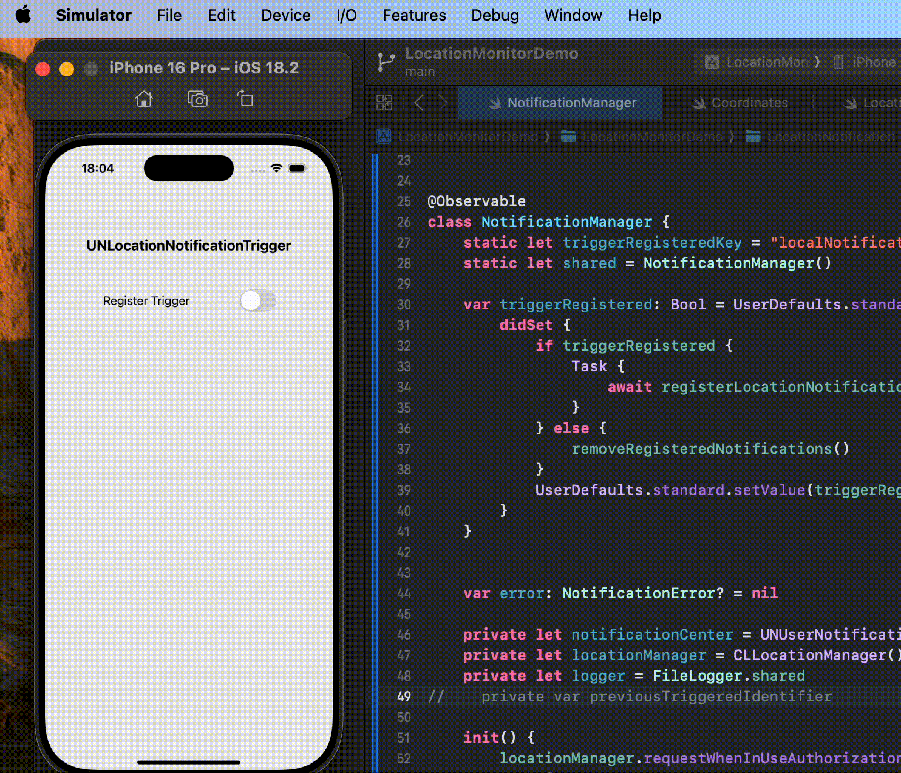
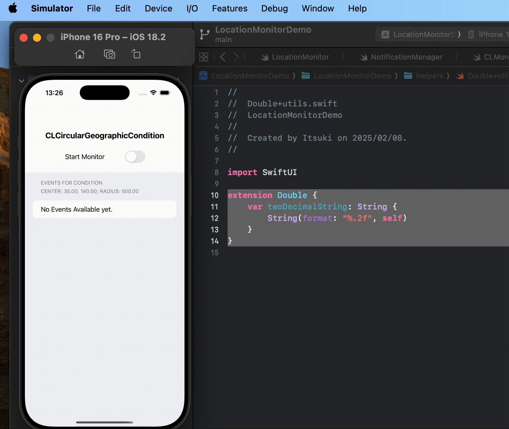

# SwiftUI: Geofencing Demo (Foreground & Background)

A demo on Monitoring User Location Relative to a Region in both foreground and background using two different approaches.

## With Local Push Notification: UNLocationNotificationTrigger

Set up needed:
1. Privacy - Location When In Use Usage Description only

## With With CLMonitor and CLCircularGeographicCondition

Set up needed:
1. Privacy - Location Always and When In Use Usage Description (Always usage is required for receiving background update)
2. NSLocationRequireExplicitServiceSession: Explicit `CLServiceSession` with always usage authorization is required for receiving background update
3. Background Mode Capability

Optional Set up
1. Privacy - Location Temporary Usage Description Dictionary for requesting full accuracy permission

## Further Detail
For more details, please refer to [SwiftUI: Monitor User Location Relative to a Region (Geofencing) 2 Ways](https://medium.com/@itsuki.enjoy/swiftui-monitor-user-location-relative-to-a-region-geofencing-2-ways-534fa3ed0e8a)
